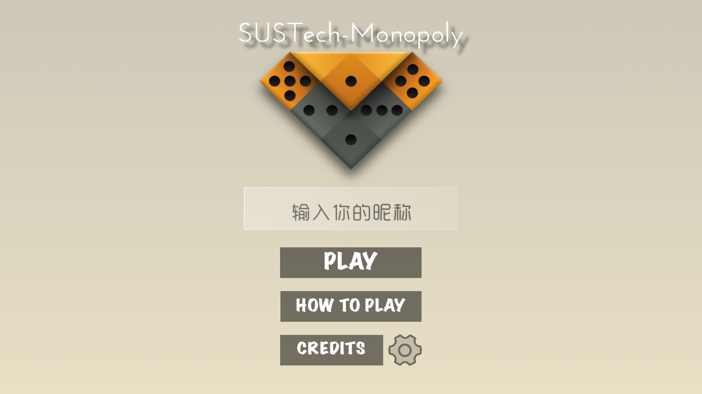
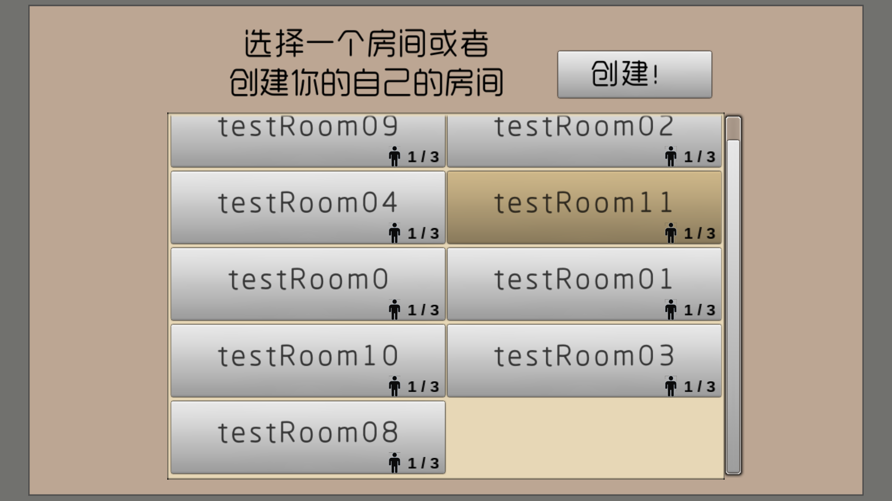
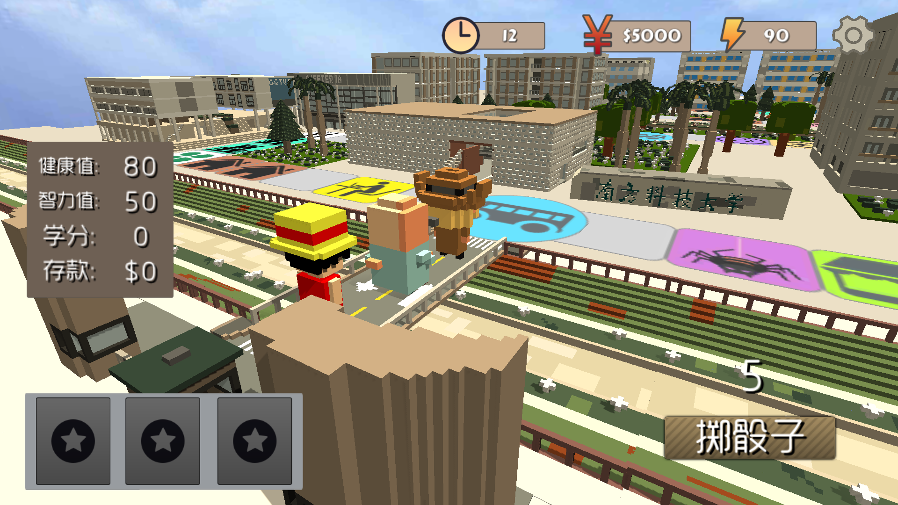
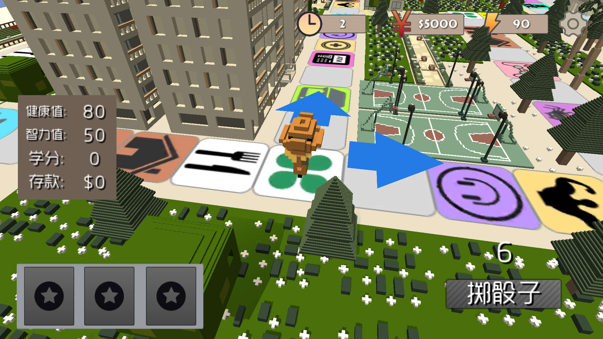
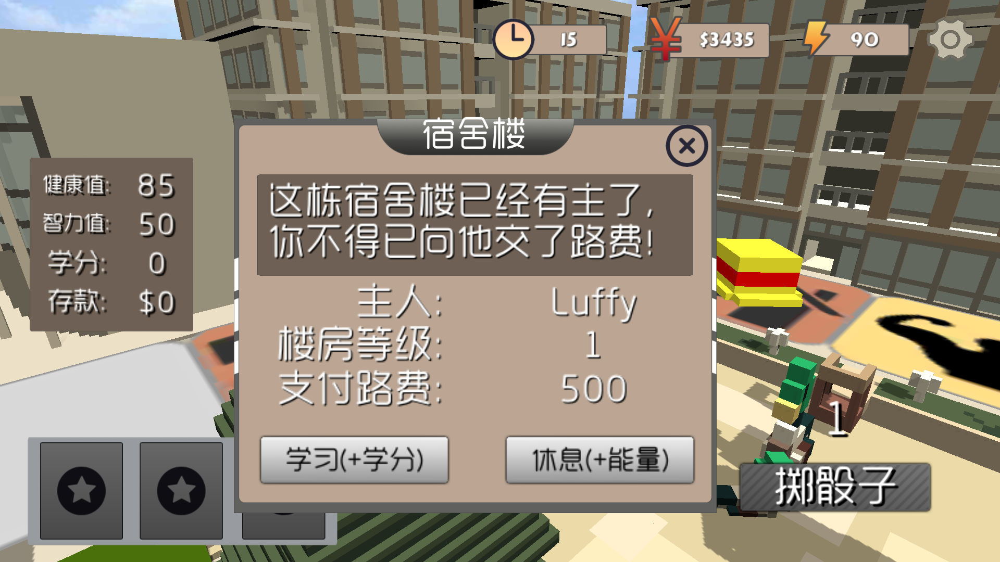

# Sustech Monopoly

A 3D multiplayer Monopoly game revolving around the campus life at SUSTech. The events are close to the daily lives of the students and the 3D graphics was modelled after the real-life campus.

After entering your name, you can get to the lobby which shows the list of rooms available. When 3 people are in the same room, the game will start. In this game you can work, study, buy item card, take buses... Do whatever you can to make your campus life wonderful. After 4 years of campus life (40 rounds in game), the game will make a comprehensive evaluation on everyone's life, the one who gets the highest score wins.

Made with HuangYuan, WuBohao in 2018.

This game can be played on PC or Android smartphone. 